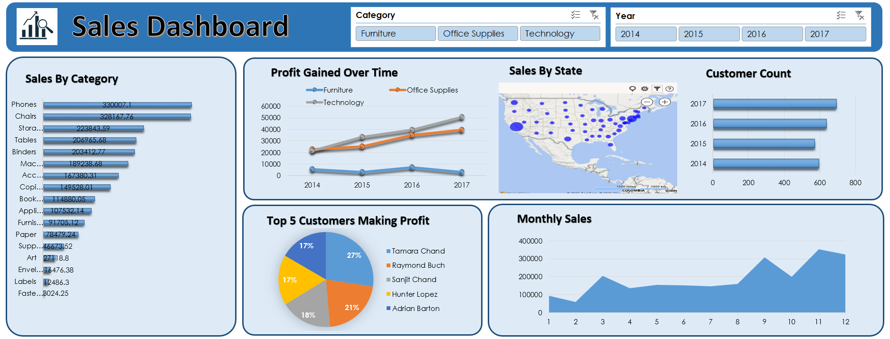

# 📊 Sales Data Analysis and Dashboard
This repository contains an in-depth analysis of sales data, focusing on key performance indicators, regional sales trends, and profitability by product category. The analysis is supported by a comprehensive interactive dashboard for easy visualization and exploration.

---
## 🚀 Project Overview
The primary goal of this project is to analyze a dataset of sales transactions to derive actionable insights for business decision-making.


| Feature | Description |
| :--- | :--- |
| **Data Source** | `salesdata.csv` (Contains detailed transaction records) |
| **Analysis Focus** | Sales performance, profit margins, quantity sold, and category/sub-category breakdown. |
| **Visualization Tool** | **Microsoft Excel** (Used for data analysis, charting, and dashboard creation). |
| **Key Insights** | Identifying top-performing states, categories, and products, as well as areas of low profitability or negative margins. 
---

## 🎯 Problem Statement
The organization faces challenges in achieving consistent growth and optimizing profitability due to a lack of clear, centralized visibility into sales performance. Specifically:

- **Performance Gaps:** There is a need to identify underperforming regions and low-margin product categories that are draining resources.

- **Strategic Direction:** Business leaders lack a unified view to make data-driven decisions regarding inventory, marketing spend, and sales force allocation.

This project was initiated to transform raw sales transaction data into a functional, intuitive dashboard that provides actionable insights, enabling the business to maximize revenue and increase net profit across all dimensions.|

---
## 🗃️ Dataset: salesdata.csv
The dataset includes the following core columns:
| Column Name | Data Type | Description |
| :--- | :--- | :--- |
| **Order Date** | Date | Date of the sales transaction. |
| **Customer Name** | String | Name of the customer. |
| **State** | String | State where the sale occurred. |
| **Category** | String | High-level product category (e.g., Furniture, Technology). |
| **Sub-Category** | String | Specific product sub-category (e.g., Chairs, Phones). |
| **Product Name** | String | Full name of the product sold. |
| **Sales** | Numeric | Total revenue from the transaction. |
| **Quantity** | Integer | Number of units sold. |
| **Profit** | Numeric | Profit/Loss generated from the transaction. |


---

## 📈 Dashboard & Key Visualizations

The generated dashboard provides a dynamic view of the sales data. Key elements of the dashboard include:

* **Total Sales & Total Profit:** Headline cards for immediate assessment of overall performance.
* **Sales Trend over Time:** Line chart showing sales and profit fluctuations by year/month.
* **Sales by State/Region:** Visualization highlighting geographical sales distribution.
* **Profitability by Category/Sub-Category:** Charts to quickly identify profitable and unprofitable product lines.



---
## 🛠️ Technologies Used

* **Data Analysis & Visualization:** **Microsoft Excel** (Used for data cleaning, calculating metrics, and creating all charts/the dashboard).
* **Data Source:** Raw data provided in `salesdata.csv`.
* **Version Control:** Git & GitHub.
---
## 📝 How to Use This Repository

1.  **Clone the Repository:**
    ```bash
    git clone [https://github.com/ruchikakumbhar-tech/Sales-Data-Analysis-Excel-Dashboard]
    cd [Sales-Data-Analysis-Excel-Dashboard]
    ```
2. **View the Data:** The raw data is available in salesdata.csv.

3. **Analyze the Dashboard:** Review the dashboard image (dashboard.png) to understand the final visualization.
---
## 🤝 Contact & Collaboration
I'm Ruchika Kumbhar, always open to work and collaborations on data analytics and dashboard projects. If you found this analysis insightful or are interested in working together, please feel free to connect!

LinkedIn: linkedin.com/in/ruchika-kumbhar-da

GitHub: github.com/ruchikakumbhar-tech

Thank you for checking out this project! 🚀 

Feel free to explore, reuse the visuals, and suggest improvements or collaboration ideas.
    